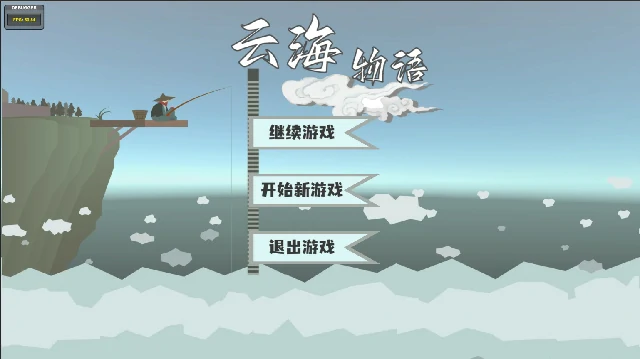
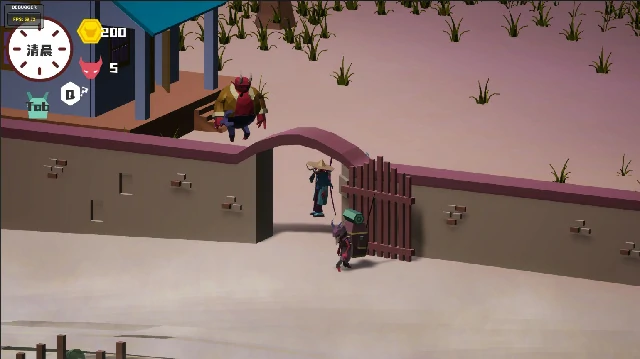
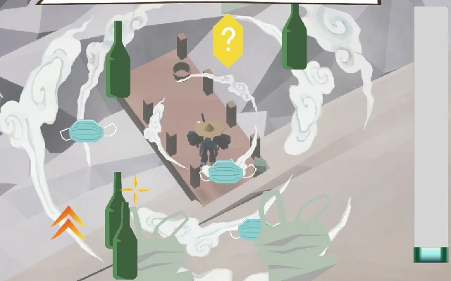
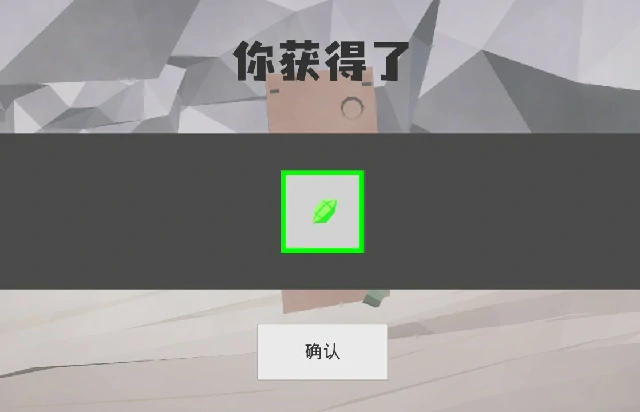
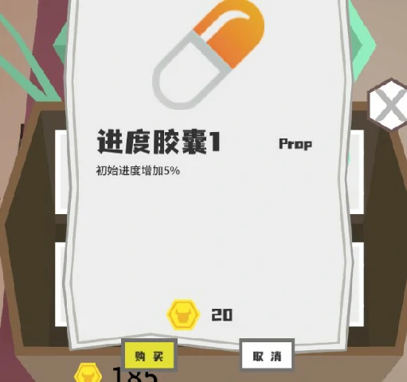
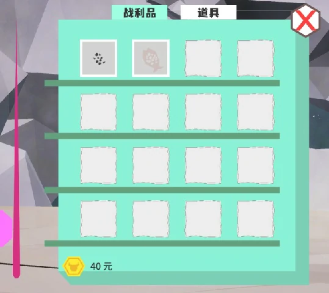
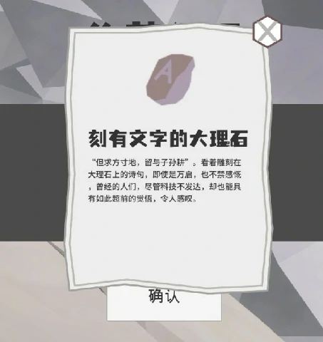
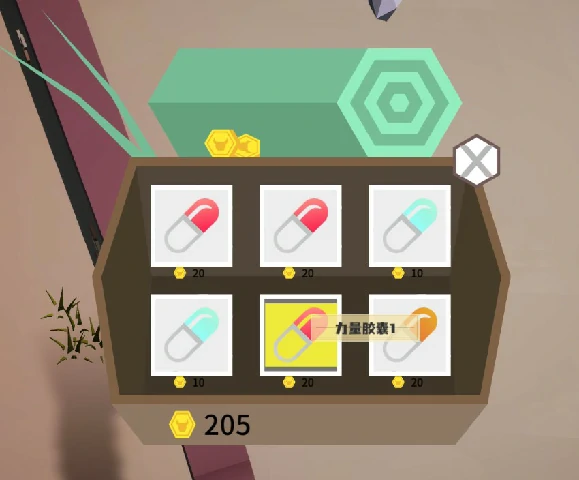
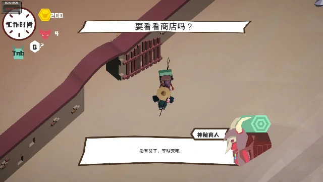

# Fishing/云海物语
参赛作品  

## 描述
使用UnityGameFramework框架开发。  
前期花了很多时间研究框架和造轮子，后面比较赶。

## 剧情

由sg设计：  
在云海之上的浮岛城市，人们已经忘了地面世界的存在，因为地面世界已经被垃圾淹没了。  
一位少年被考古学家叫去钓鱼，钓取远古（现代）世界的遗物，探究世界的真相。  

## 游戏系统

### 核心玩法

以钓鱼玩法为核心，核心玩法来自lbk，其他部分由sg设计。  
玩家在一个圈中通过鼠标引导鱼漂，需要不断控制保持鱼漂停留在合适位置，其中会遇到海洋垃圾的阻碍，降低鱼漂速度。通过快速点击消除障碍物。鱼漂停留在目标上足够多的时间就可以捕获。  
每次钓鱼会消耗体力。

### 渔获

钓鱼可能钓到鱼、强化材料、和远古遗物。  
- 鱼和材料可以卖出获得金币。
- 材料可以升级鱼竿。
- 远古遗物提交给考古学家，逐步解锁剧情，每种遗物只能获取一次。  

### 药剂/Buff

金币可以在流浪商人处购买强化药剂，使用后为自身增加效果，buff效果会显示在背包中，分别能：  
- 幸运（Buff）：增加钓到高等级物品的概率。
- 力量（Buff）：增加对障碍物的伤害。
- 体力：增加玩家体力。
- 遗忘：清空当前buff。

### 等级

鱼、强化材料、和远古遗物，以及鱼竿都分为5种等级。
- 鱼等级越高价值越高。
- 升级强化材料等级。
- 升级鱼竿增加基础力量，和钓到高等级渔获的概率（增加了鱼线的深度）。
- 逐步解锁高等级鱼竿（意味着深度更深），获取高等级远古遗物，离真相越近。

### 收集

遗物按照等级顺序获取，和其他渔获一起上交给考古学家，考古学家会在解析后解锁新文物资料。

### 时间系统

每天从清晨开始，玩家只能在清晨进行购买，升级操作。  
从钓鱼台开始钓鱼正式进入垂钓时间，在体力耗尽后进入黄昏。  
黄昏时可提交文物,第二天清晨时文物解析就完成了，此时会强制玩家去考古学家处接取剧情事件。  
第二天还会刷新商店物品

### 对话系统

负责剧情对话以及提示文本。

## 心得
2个月的开发时间，对框架不熟悉，也缺乏经验积累，整个系统的设计没有考虑清楚，在业务上薄弱，进度缓慢。
很多实际需求都是从头造轮子，只是满足了自己的学习需求，没有考量项目落地。
也没有能提供给策划使用的开发工具，也没有其他了解框架的人，项目事务基本都只能由一个程序负责，相当于无分工，也加大了开发的混乱程度。
团队开发进度基本卡在程序这，缺乏项目管理。

